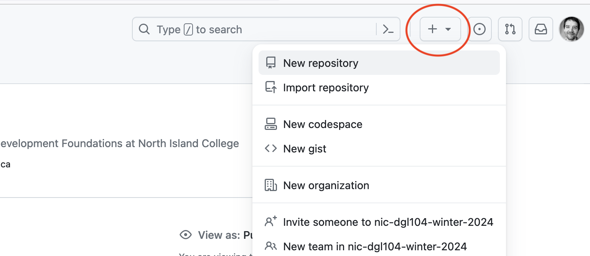
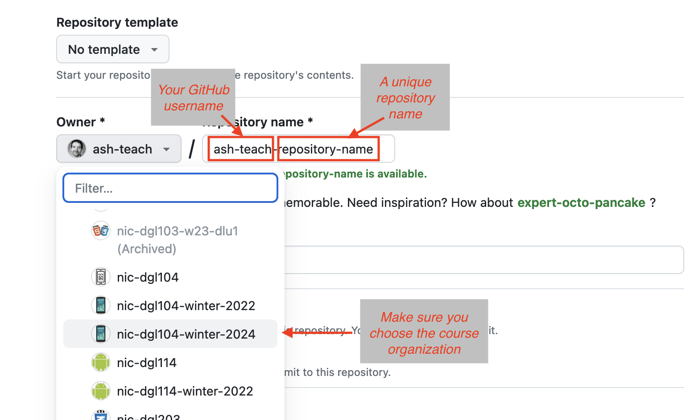
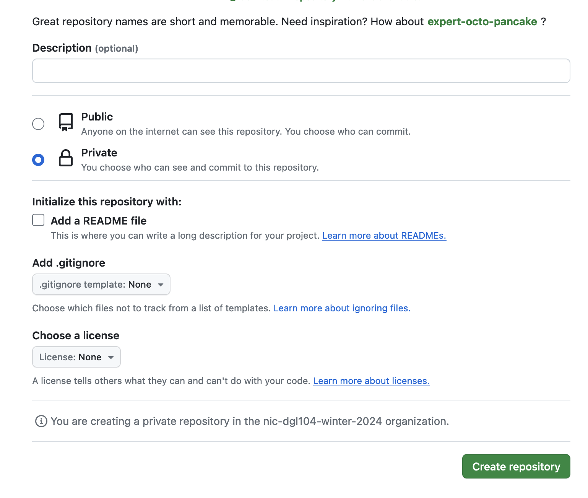
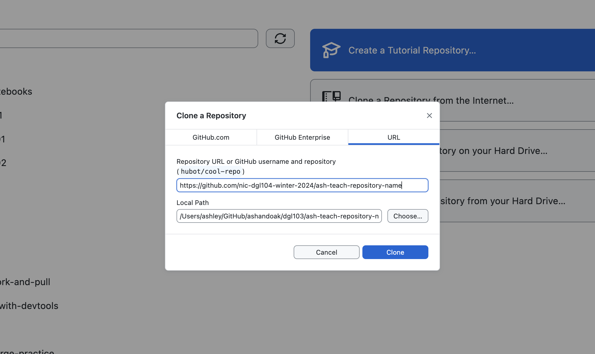
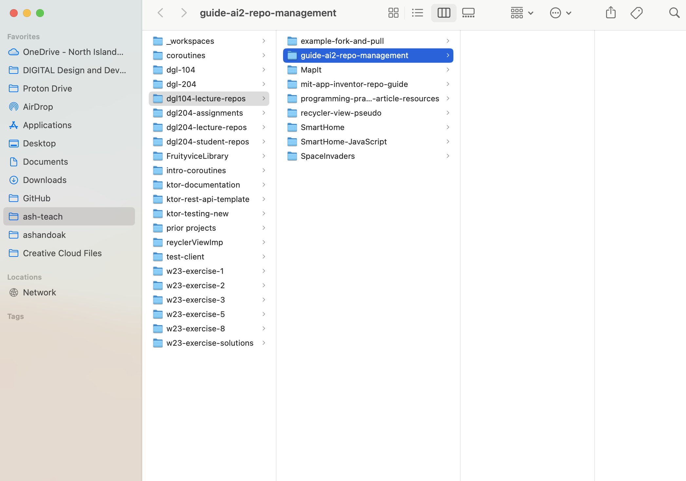
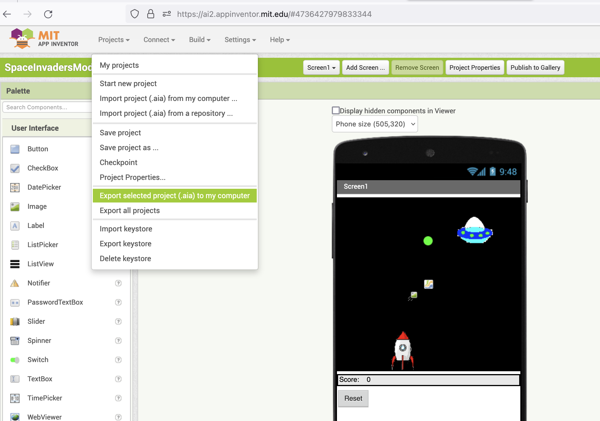
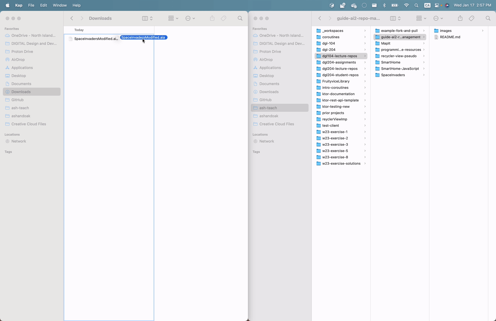

# MIT App Inventor Resources and Guide
_A guide for the creation of new repositories in our class organization and for managing MIT App Inventor repositories and code review._

## Introduction
This repository is intended as both a guide to support you in two key tasks:
1. Creating new repositories in our [course organization](https://github.com/nic-dgl104-winter-2024)
2. Managing MIT App Inventor repositories and code review strategies

Both of these are critical since all your DGL 104 work should be stored on our course organization and not in your personal GitHub account. I'll never close this organization, so your code will always be accessible. If you prefer to make your projects developed for DGL 104 available on your personal GitHub account I can demonstrate how to do this at the end of the semester.

Note that this repository also contains an MIT App Inventory `.aia` file for a complete implementation of the [Space Invaders](https://appinventor.mit.edu/explore/ai2/space-invaders) game (although with some minor modifications). To get the most out of this repository you should read this `README.md` carefully, and also closely examine the repository pull requests, which demonstrate an approach to code review for `.aia` files.

## Creating new repositories
If you are unfamiliar with the GitHub workflow, or need a refresher on how GitHub works there are many excellent guides available that teach some of the basics. Our internally developed [GitHub and GitHub Desktop Reference Guide](https://docs.google.com/document/d/1gyy_7hXB4RSJ_T4Ua1ezKujfr2Ohz3B8EE2e11ZTZyU/edit#) is one such resource, but there are plenty of great guides available via [GitHub Docs](https://docs.github.com/en/get-started/quickstart/hello-world) as well.

I encourage you to experiment with GitHub and with your chosen [IDE](https://en.wikipedia.org/wiki/Integrated_development_environment) (integrated development environment) and Git client (such as [GitHub Desktop](https://docs.github.com/en/desktop/overview/about-github-desktop)) locally to find a workflow that works well for you. Every modern IDE typically includes native support for Git-based workflows and many include plugins that allow direct interfacing with GitHub.

This guide will take an approach that you can adapt to whatever tools you are using and should be fairly easy to follow. If you run into any problems let me know! Or if you can think of ways to improve this guide open a pull request!

To ensure that you create DGL 104 repositories in our organization (and not on your personal account) follow these steps:

### 1. Create a new repository on GitHub
Make sure you're logged into GitHub an click on the `+` button on the upper right corner of the page and select 'New repository' from the menu.

### 2. Name the new repository and store in nic-dgl104-winter-2024
Always take the following three actions when creating a repository for DGL 104:
1. Prepend your repository name with your GitHub username (e.g. mine starts with 'ash-teach').
2. Give your repository name a unique and meaningful name (e.g. 'programming-practice-article').
3. Click the dropdown button on your GitHub user name and choose our course organization, `nic-dgl104-winter-2024`, from the list.

All these steps are necessary to ensure you have a uniquely named repository stored on our course organization.

### 3. Choose options and press Create Repository button
- **Description**: Completely optional. I do not require it.
- **Private vs public**: Default is private. Private means only organization members can see your repository (i.e. me and everyone in the class). Public means your repository will be visible to anyone with the url and will be searchable. I recommend private, though public is fine if you would rather make it widely visible. You can always change this setting later.
- **Initialize repo with README, .gitignore, and/or a license**: You are welcome to choose any of these, however if you do your next step will look different from the example here. If this process is new to you I recommend to leave these settings alone.

### 4. Open the repository in GitHub Desktop
The next page looks complicated (and again - will look different than pictured below if you elected to initialize your repository with any of README, .gitignore, or a license), but you can ignore most of the text.

The easiest approach, if you have GitHub Desktop installed, is to click the circled "Set up in Desktop" button. which will open GitHub Desktop and begin the cloning process. If you take this approach jump to step #5 from here.

Alternatively, if you prefer not to use GitHub Desktop (or just not via the circled button) you can copy the repository url and add it as a remote to whichever tool you are using for repository management. Alternatively, if you like the command line, the provided text walks you through the command line steps if you are creating a repository from scratch, or if you already have a repository initialized.

### 5. Clone your remote repository
If you've followed the instructions above and you have GitHub Desktop installed and logged in you should see a window similar to the following pop up. The first text field contains the url to the GitHub repository you just created. 

The second text field is the default folder where you new repository will be cloned to on your hard drive. I recommend that you press the Choose... button and choose an appropriate folder (or create a new one) that works for whatever local organization approach you use. 

### 6. Open the local repository
Use Explorer (Windows) or Finder (MacOS) to navigate to the folder that your repository has been cloned to. The folder will be empty, but anything you put into it can now be tracked as part of the repository and committed via GitHub Desktop.

## Managing an MIT App Inventor repository
Managing an `AI2` project is a bit more cumbersome than managing other code-based projects on GitHub: Since App Inventor development happens exclusively through the `AI2` web app, and since there is no way for GitHub to render the block-based `AI2` code the information surfaced via GitHub with `AI2` projects is fairly opaque. However, storing these projects on GitHub is still a good approach, since it makes the project easily accessible, and makes code review possible (even though it's a little less smooth of a process compared to typical code-based projects).

Take the following steps to push `AI2` code to a GitHub repository (note that you must already have created a remote GitHub repository and cloned it locally, as [demonstrated above](#creating-new-repositories), to complete the following steps.):

### 1. Export your `AI2` project as an `.aia` file
Open your project in the [MIT App Inventor](https://ai2.appinventor.mit.edu) web app. Click the Projects menu drop down and choose 'Export selected project (.aia) to my computer'. 

### 2. Move your `.aia` file to your local repository
The 'Export selected project...' menu option probably saved your `.aia` file to your Downloads folder. Find it using Explorer (Windows) or Finder (MacOS) and move it to the local copy of your repository.

### 3. Commit and push to GitHub

## Conclusion

